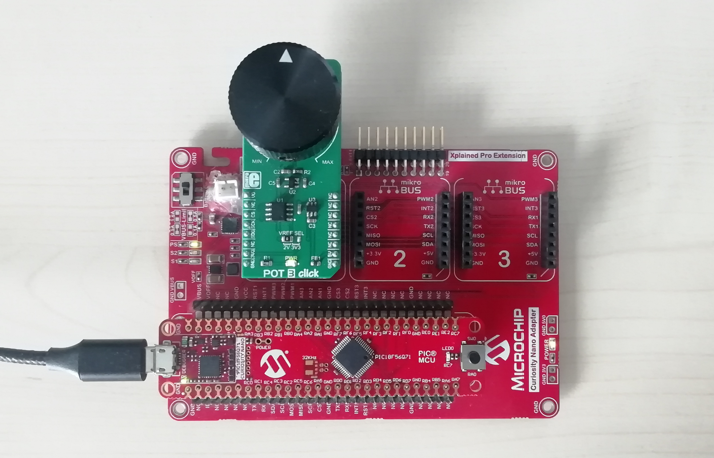
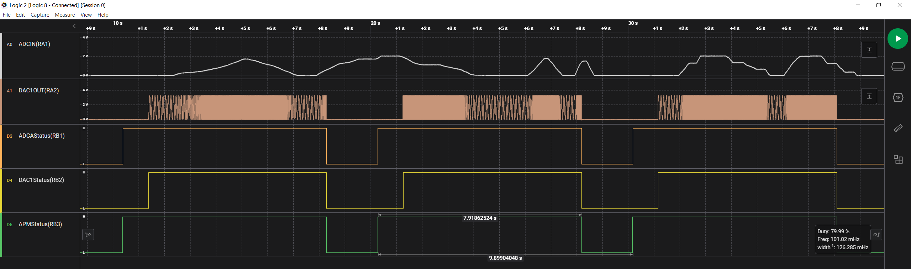
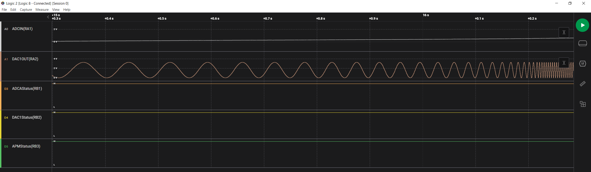
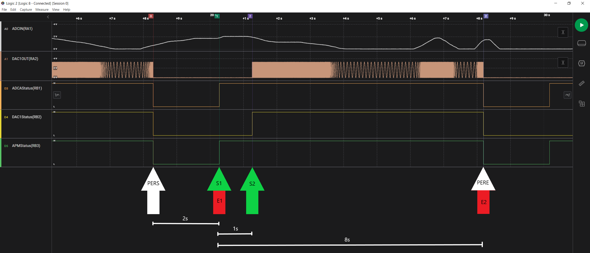
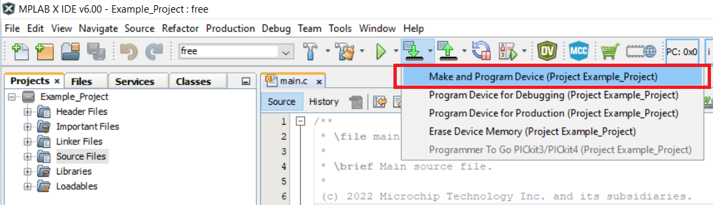

# Analog Peripheral Manager (APM) — Sine waveform generation with ADC, DAC and APM using PIC18F56Q71 Microcontroller with MCC Melody

This code example highlights the capabilities of the Analog Peripheral Manager (APM) as well as its configuration in MCC Melody. The Digital-to-Analog Converter (DAC) is used to output a sine waveform with variable frequency controlled by the value measured by the Analog-to-Digital Converter (ADC) from a potentiometer. The Timer0 (TMR0) module is used as auto-conversion trigger source for the ADC peripheral while the Timer1 (TMR1) module’s overflow interrupt is used to alter the output of the DAC peripheral. The ADC peripheral’s conversion-complete interrupt is used to modify the overflow period of TMR1 module. The APM periodically enables the ADC and DAC to perform conversions and output the sine waveform respectively.

## Related Documentation

More details and code examples on the PIC18F56Q71 can be found at the following links:

- [PIC18-Q71 Product Family Page](https://www.microchip.com/en-us/products/microcontrollers-and-microprocessors/8-bit-mcus/pic-mcus/pic18-q71)
- [PIC18F56Q71 Code Examples on GitHub](https://github.com/orgs/microchip-pic-avr-examples/repositories?q=pic18f56q71&type=all&language=&sort=)

## Software Used

- [MPLAB® X IDE](http://www.microchip.com/mplab/mplab-x-ide) v6.10 or newer
- [MPLAB® XC8](http://www.microchip.com/mplab/compilers) v2.41 or newer
- [PIC18F-Q Series Device Pack](https://packs.download.microchip.com/) v1.18.389 or newer

## Hardware Used

- The [PIC18F56Q71 Curiosity Nano](https://www.microchip.com/en-us/development-tool/EV01G21A) development board is used as a test platform:
   

- [Curiosity Nano Adapter](https://www.microchip.com/en-us/development-tool/AC164162):
   

- [POT 3 CLICK](https://www.mikroe.com/pot-3-click) board (mikroBUS socket 1):
   
 

## Operation

To program the Curiosity Nano board with this MPLAB® X project, follow the steps provided in the [How to Program the Curiosity Nano Board](#how-to-program-the-curiosity-nano-board) chapter.  

## Setup

The following configurations must be made for this project:

- Clock Control:
  - Clock Source: HFINTOSC
  - HF Internal Clock: 64 MHz
  - Clock Divider: 1
- Configuration bits:
  - WDT operating mode: WDT Disabled
- Interrupt Manager:
  - Enable Vectored Interrupt: Yes
  - ADC Interrupt: Low Priority
- TMR0:
  - Enable Timer: Yes
  - Clock Prescaler: 1:4096
  - Postscaler: 1:1
  - Timer Mode: 8-bit
  - Clock Source: HFINTOSC
  - Enable Synchronisation: No
  - Requested Period: 0.01 s
  - TMR Interrupt: No
- TMR1:
  - Enable Timer: Yes
  - 16-bit Read/Write Mode Enable: Yes
  - Clock Source: HFINTOSC
  - Prescaler: 1:1
  - Timer Period: 8 us
  - TMR Interrupt Enable: Yes
- DAC1:
  - VDD: 3.3 V
  - Required ref: 3.3 V
  - DAC Enable: No
  - DAC Positive reference selection: VDD
  - DAC Negative reference selection: VSS
  - DAC Output Enable Selection: DACOUT1 Enabled and DACOUT2 Disabled
- ADC:
  - ADC Enable: No
  - Input Configuration: single-ended mode
  - Auto-conversion Trigger Source: TMR0
  - Result Format: right justified
  - VDD: 3.3 V
  - Clock Selection: FOSC
  - Clock Divider: FOSC/64
  - ADI Interrupt: Enabled
  - Context 1 configuration:
    - Positive Channel Selection: ANA1
    - Positive Voltage Reference: VDD
    - Operating Mode Selection: Basic mode
- APM:
  - Enable APM: Yes
  - Clock Source: LFINTOSC
  - Requested Period: 10 s
  - APM Events:
    - Start 1: enable ADCA
    - End 1: -
    - Start 2: enable DAC1
    - End 2: disable ADCA and DAC1 
  - Requested Start 1: 2 s
  - Requested End1: 0 s
  - Requested Start 2: 1 s
  - Requested End 2: 8 s

| Pin | Configuration  |        Description        |
| :-: | :------------: | :-----------------------: |
| RA1 |  Analog input  |        potentiometer      |
| RA2 |  Analog output |            DAC1           |
| RB1 | Digital output |         ADCA status       |
| RB2 | Digital output |         DAC1 status       |
| RB3 | Digital output |   analog modules status   |

| Pin |     Label      |
| :-: | :------------: |
| RB1 |   ADCAStatus   |
| RB2 |   DAC1Status   |
| RB3 |   APMStatus    |

 

## Demo

Board setup:

 

Logic analyzer screen captures:

 
 
 

## Summary

This code example shows how to configure the APM to toggle the ADC and DAC peripherals and generate a sine waveform with variable frequency.

  
[Back to Top](#analog-peripheral-manager-apm--sine-waveform-generation-with-adc-dac-and-apm-using-pic18f56q71-microcontroller-with-mcc-melody)

 

## How to Program the Curiosity Nano Board

This chapter demonstrates how to use the MPLAB® X IDE to program a PIC® device with an Example_Project.X. This is applicable to other projects.

1.  Connect the board to the PC.

2.  Open the Example_Project.X project in MPLAB® X IDE.

3.  Set the Example_Project.X project as main project.
     Right click the project in the **Projects** tab and click **Set as Main Project**.
     

4.  Clean and build the Example_Project.X project.
     Right click the **Example_Project.X** project and select **Clean and Build**.
     

5.  Select **PICxxxxx Curiosity Nano** in the Connected Hardware Tool section of the project settings:
     Right click the project and click **Properties**.
     Click the arrow under the Connected Hardware Tool.
     Select **PICxxxxx Curiosity Nano** (click the **SN**), click **Apply** and then click **OK**:
     

6.  Program the project to the board.
     Right click the project and click **Make and Program Device**.
     

 

- [Back to Setup](#setup)
- [Back to Demo](#demo)
- [Back to Summary](#summary)
- [Back to Top](#analog-peripheral-manager-apm--sine-waveform-generation-with-adc-dac-and-apm-using-pic18f56q71-microcontroller-with-mcc-melody)
